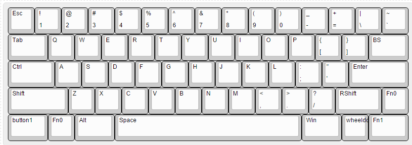
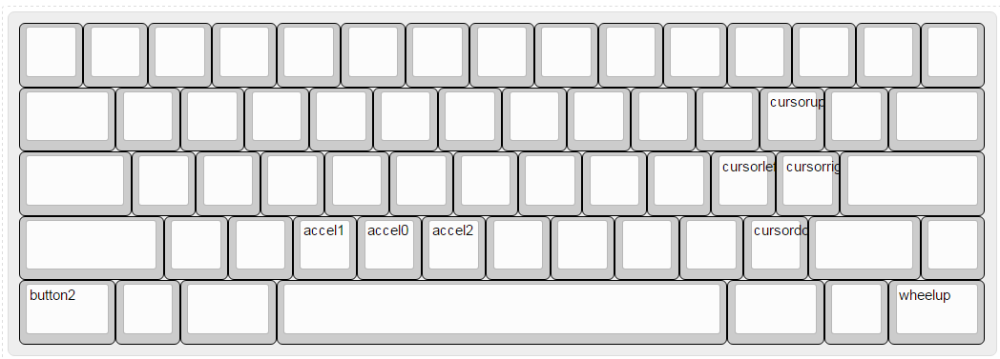

Another HHKB layout for my GH60.

I switched the shift/fn, however, I cannot find a 6u space stabilizer.
Therefore I removed the RAlt and kept using 7u space bar. 

There are three layers in total.

