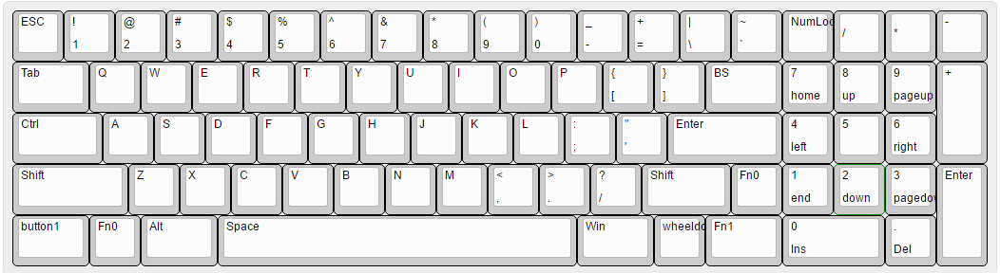
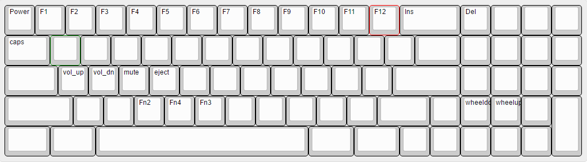
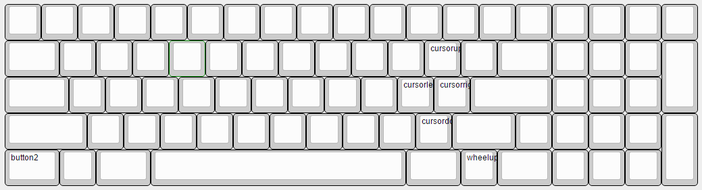

I bought a RS77 from someone on Taobao. A little expensive but I'm quite satisfied with its layout.

I have modified the layout into my GH60+numpad. tried to have a 6u space bar, however, the fly line doesn't stable. To stable, it has to move around 0.3u space then the keycap cannot be put inside :(

There is still no arrow keys ;)

